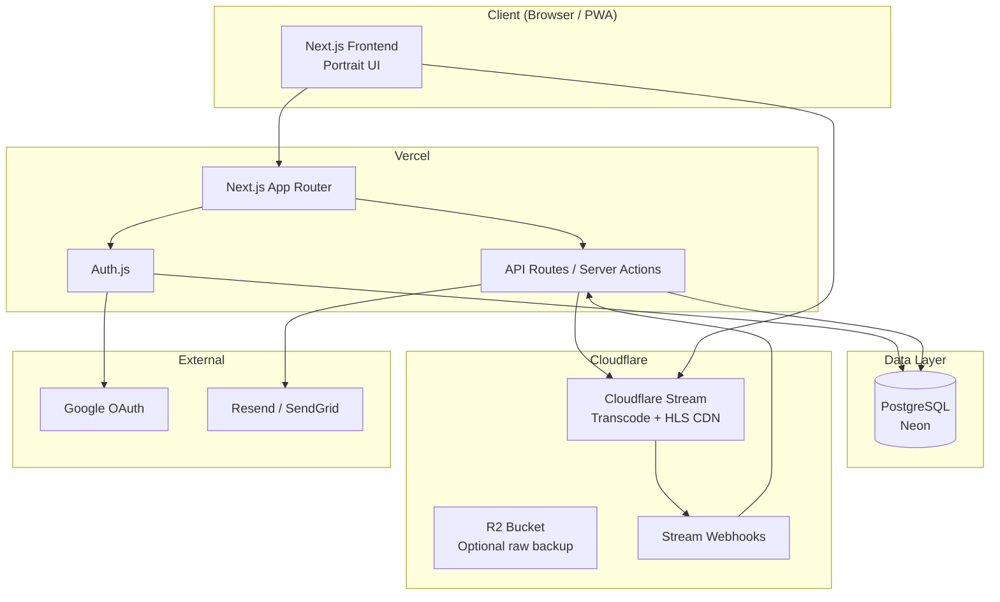

# 04 — Technical Architecture

Stack and integration design for Aura Dracin with **Cloudflare** video hosting, **email/password** auth, **admin-only** uploads, and **city-level** geo.

---

## Stack Overview

| Layer | Technology |
|-------|------------|
| Framework | Next.js 14+ (App Router) |
| Language | TypeScript |
| Styling | Tailwind CSS |
| Database | PostgreSQL (Neon recommended) |
| ORM | Drizzle ORM or Prisma |
| Auth | Auth.js v5 (NextAuth) |
| Video storage & delivery | Cloudflare R2 + Cloudflare Stream |
| Email (password reset) | Resend or SendGrid |
| GeoIP | Cloudflare `CF-IPCity` header or MaxMind GeoLite2 |
| Hosting (app) | Vercel |
| Hosting (media) | Cloudflare |

---

## System Architecture



---

## Cloudflare Video Pipeline

### Why Cloudflare Stream

- Managed transcoding to HLS (adaptive bitrate)
- Global CDN included
- Direct upload API + tus protocol
- Webhooks for `video.ready`, `video.error`
- Portrait 9:16 supported natively

### Upload flow (admin)

```
Admin UI
  │
  ├─1─► POST /api/admin/videos/upload-url
  │       Server validates admin session
  │       Returns Stream direct upload URL + video UID
  │
  ├─2─► PUT/POST to Cloudflare Stream (client or server)
  │       Video file uploaded
  │
  ├─3─► Cloudflare transcodes → HLS manifest
  │
  ├─4─► Webhook POST /api/webhooks/cloudflare-stream
  │       Event: video.ready
  │       Update videos.stream_id, thumbnail_url, duration
  │
  └─5─► Admin fills metadata → PATCH /api/admin/videos/:id
          title, description, hashtags, category, published
```

### Playback

- Embed Cloudflare Stream player or use HLS URL in custom portrait player
- Player URL pattern: `https://customer-{code}.cloudflarestream.com/{uid}/manifest/video.m3u8`
- Thumbnail: `https://customer-{code}.cloudflarestream.com/{uid}/thumbnails/thumbnail.jpg?time=5s`

### R2 (optional backup)

- Store original upload in R2 bucket `aura-dracin-raw` for disaster recovery
- Not required for MVP playback path

### Environment variables

```env
# Cloudflare
CLOUDFLARE_ACCOUNT_ID=
CLOUDFLARE_API_TOKEN=
CLOUDFLARE_STREAM_CUSTOMER_CODE=
CLOUDFLARE_STREAM_WEBHOOK_SECRET=

# R2 (optional)
R2_ACCESS_KEY_ID=
R2_SECRET_ACCESS_KEY=
R2_BUCKET_NAME=
R2_ENDPOINT=

# Database
DATABASE_URL=

# Auth
AUTH_SECRET=
GOOGLE_CLIENT_ID=
GOOGLE_CLIENT_SECRET=

# Email
RESEND_API_KEY=
EMAIL_FROM=noreply@auradracin.com
```

---

## Authentication (Auth.js)

### Providers

| Provider | Config |
|----------|--------|
| **Credentials** | Email + bcrypt password |
| **Google** | OAuth 2.0 |

### Session strategy

- JWT session (default) or database sessions
- JWT sufficient for MVP; add DB sessions if revocation needed

### Password flow

```
Sign up:
  POST /api/auth/register
    → validate email unique
    → hash password (bcrypt, cost 12)
    → create user (role: user)
    → redirect to login

Login:
  Auth.js credentials provider
    → verify email + password
    → issue session

Forgot password:
  POST /api/auth/forgot-password
    → generate reset token (1h expiry)
    → send email via Resend
  POST /api/auth/reset-password
    → validate token, update password hash
```

### Admin access

- `users.role` enum: `user` | `admin`
- Middleware: `/admin/*` requires `role === admin`
- Seed first admin via migration script

### Google OAuth

- On first sign-in: create user with `email`, `name`, `avatar_url` from Google profile
- Link accounts by email if email/password user exists (optional, handle carefully)

---

## API Routes (MVP)

### Public

| Method | Route | Description |
|--------|-------|-------------|
| GET | `/api/videos` | List videos (filters: popular, recent, category, city) |
| GET | `/api/videos/[slug]` | Single video + engagement counts |
| GET | `/api/categories` | All categories |
| GET | `/api/videos/[id]/comments` | List comments |

### Authenticated (user)

| Method | Route | Description |
|--------|-------|-------------|
| POST | `/api/videos/[id]/like` | Toggle like |
| POST | `/api/videos/[id]/comments` | Add comment |
| PATCH | `/api/comments/[id]` | Edit own comment |
| DELETE | `/api/comments/[id]` | Delete own comment |
| PATCH | `/api/user/profile` | Update name, city |

### Admin

| Method | Route | Description |
|--------|-------|-------------|
| POST | `/api/admin/videos/upload-url` | Get Stream upload URL |
| POST | `/api/admin/videos` | Create video record |
| PATCH | `/api/admin/videos/[id]` | Update metadata |
| DELETE | `/api/admin/videos/[id]` | Soft delete |
| GET | `/api/admin/videos` | List all (incl. drafts) |

### Webhooks

| Method | Route | Description |
|--------|-------|-------------|
| POST | `/api/webhooks/cloudflare-stream` | Handle Stream events |

---

## Popularity & City Aggregation

### View tracking

```sql
INSERT INTO video_views (video_id, user_id, city, created_at)
-- city from user.profile.city OR GeoIP at request time
-- debounce: max 1 view per video per session per 30 min
```

### Lagi Populer (global)

```sql
SELECT v.*, 
  COUNT(DISTINCT l.id) FILTER (WHERE l.created_at > NOW() - INTERVAL '7 days') AS likes_7d,
  COUNT(DISTINCT vw.id) FILTER (WHERE vw.created_at > NOW() - INTERVAL '7 days') AS views_7d
FROM videos v
LEFT JOIN likes l ON l.video_id = v.id
LEFT JOIN video_views vw ON vw.video_id = v.id
WHERE v.published = true
GROUP BY v.id
ORDER BY (likes_7d * 0.7 + views_7d * 0.3) DESC
LIMIT 20;
```

### Lagi Rame di {kota} (city-level only)

```sql
-- Aggregate engagement where viewer city = target city
SELECT v.*, COUNT(*) AS city_engagement
FROM videos v
JOIN (
  SELECT video_id FROM likes l
  JOIN users u ON u.id = l.user_id
  WHERE u.city = $1 AND l.created_at > NOW() - INTERVAL '7 days'
  UNION ALL
  SELECT video_id FROM video_views vw
  WHERE vw.city = $1 AND vw.created_at > NOW() - INTERVAL '7 days'
) eng ON eng.video_id = v.id
WHERE v.published = true
GROUP BY v.id
ORDER BY city_engagement DESC
LIMIT 10;
```

### GeoIP resolution

1. **Preferred:** User sets `city` on profile
2. **Fallback:** `CF-IPCity` header on Vercel/Cloudflare edge
3. **No province/GPS** — city string only, matched against predefined city list

---

## Security

| Concern | Mitigation |
|---------|------------|
| Admin upload abuse | Admin role check on all `/api/admin/*` |
| Comment spam | Rate limit: 10 comments/min per user |
| XSS in comments | Sanitize HTML; escape on render |
| CSRF | Auth.js built-in; SameSite cookies |
| Webhook spoofing | Verify Cloudflare webhook signature |
| Password storage | bcrypt, never store plaintext |
| Video hotlinking | Stream signed URLs (optional Phase 2) |

---

## Portrait Validation (upload)

Client-side before upload:
```typescript
const ratio = width / height;
const target = 9 / 16; // 0.5625
const tolerance = 0.05;
if (Math.abs(ratio - target) > tolerance) {
  throw new Error('Video harus portrait (9:16)');
}
```

Server-side: re-validate via Stream metadata webhook if available.

---

## Deployment

| Service | Platform | Notes |
|---------|----------|-------|
| Next.js app | Vercel | Auto deploy from `main` |
| PostgreSQL | Neon | Serverless-friendly |
| Stream + R2 | Cloudflare Dashboard | Same account |
| Domain | Cloudflare DNS | `auradracin.com` or `.id` |
| Email | Resend | SPF/DKIM on domain |

### CI/CD

- GitHub Actions: lint, typecheck, test on PR
- Vercel preview deployments per PR

---

## Folder Structure (proposed)

```
aura-dracin/
├── app/
│   ├── (public)/
│   │   ├── page.tsx              # Homepage
│   │   ├── video/[slug]/page.tsx
│   │   ├── kategori/[slug]/page.tsx
│   │   └── tag/[tag]/page.tsx
│   ├── (auth)/
│   │   ├── masuk/page.tsx
│   │   ├── daftar/page.tsx
│   │   └── lupa-password/page.tsx
│   ├── admin/
│   │   ├── page.tsx              # Dashboard
│   │   ├── upload/page.tsx
│   │   └── videos/page.tsx
│   ├── api/
│   │   ├── auth/[...nextauth]/route.ts
│   │   ├── videos/
│   │   ├── admin/
│   │   └── webhooks/cloudflare-stream/route.ts
│   └── layout.tsx
├── components/
│   ├── video/                    # Player, card, carousel
│   ├── home/                     # Homepage sections
│   ├── auth/
│   └── ui/
├── lib/
│   ├── db.ts
│   ├── auth.ts
│   ├── cloudflare-stream.ts
│   └── geo.ts
├── drizzle/ or prisma/
└── public/
```
