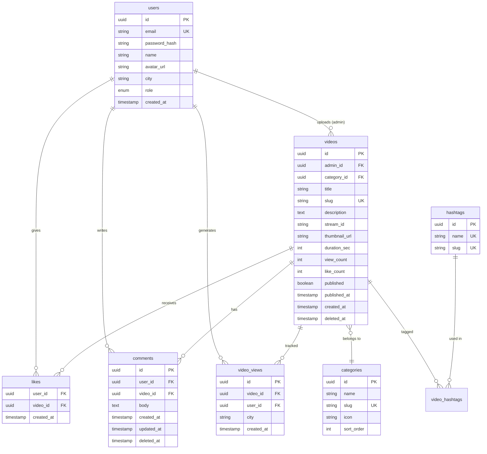

# 05 — Database Schema

PostgreSQL schema for Aura Dracin MVP.

---

## ER Diagram



---

## Table Definitions

### `users`

```sql
CREATE TYPE user_role AS ENUM ('user', 'admin');

CREATE TABLE users (
    id            UUID PRIMARY KEY DEFAULT gen_random_uuid(),
    email         VARCHAR(255) NOT NULL UNIQUE,
    password_hash VARCHAR(255),          -- NULL if Google-only account
    name          VARCHAR(100),
    avatar_url    TEXT,
    city          VARCHAR(100),          -- Indonesian city name
    role          user_role NOT NULL DEFAULT 'user',
    created_at    TIMESTAMPTZ NOT NULL DEFAULT NOW(),
    updated_at    TIMESTAMPTZ NOT NULL DEFAULT NOW()
);

CREATE INDEX idx_users_city ON users(city);
CREATE INDEX idx_users_role ON users(role);
```

### `categories`

```sql
CREATE TABLE categories (
    id         UUID PRIMARY KEY DEFAULT gen_random_uuid(),
    name       VARCHAR(50) NOT NULL,
    slug       VARCHAR(50) NOT NULL UNIQUE,
    icon       VARCHAR(50),              -- lucide icon name
    sort_order INT NOT NULL DEFAULT 0
);
```

### `videos`

```sql
CREATE TABLE videos (
    id            UUID PRIMARY KEY DEFAULT gen_random_uuid(),
    admin_id      UUID NOT NULL REFERENCES users(id),
    category_id   UUID NOT NULL REFERENCES categories(id),
    title         VARCHAR(120) NOT NULL,
    slug          VARCHAR(150) NOT NULL UNIQUE,
    description   TEXT NOT NULL,
    stream_id     VARCHAR(100),          -- Cloudflare Stream UID
    thumbnail_url TEXT,
    duration_sec  INT,
    view_count    INT NOT NULL DEFAULT 0,
    like_count    INT NOT NULL DEFAULT 0,
    published     BOOLEAN NOT NULL DEFAULT FALSE,
    published_at  TIMESTAMPTZ,
    created_at    TIMESTAMPTZ NOT NULL DEFAULT NOW(),
    updated_at    TIMESTAMPTZ NOT NULL DEFAULT NOW(),
    deleted_at    TIMESTAMPTZ            -- soft delete
);

CREATE INDEX idx_videos_published_at ON videos(published_at DESC) WHERE published = TRUE AND deleted_at IS NULL;
CREATE INDEX idx_videos_category ON videos(category_id);
CREATE INDEX idx_videos_stream_id ON videos(stream_id);
```

### `hashtags`

```sql
CREATE TABLE hashtags (
    id   UUID PRIMARY KEY DEFAULT gen_random_uuid(),
    name VARCHAR(50) NOT NULL UNIQUE,     -- e.g. "dracin"
    slug VARCHAR(50) NOT NULL UNIQUE     -- e.g. "dracin"
);
```

### `video_hashtags`

```sql
CREATE TABLE video_hashtags (
    video_id   UUID NOT NULL REFERENCES videos(id) ON DELETE CASCADE,
    hashtag_id UUID NOT NULL REFERENCES hashtags(id) ON DELETE CASCADE,
    PRIMARY KEY (video_id, hashtag_id)
);

CREATE INDEX idx_video_hashtags_hashtag ON video_hashtags(hashtag_id);
```

### `likes`

```sql
CREATE TABLE likes (
    user_id    UUID NOT NULL REFERENCES users(id) ON DELETE CASCADE,
    video_id   UUID NOT NULL REFERENCES videos(id) ON DELETE CASCADE,
    created_at TIMESTAMPTZ NOT NULL DEFAULT NOW(),
    PRIMARY KEY (user_id, video_id)
);

CREATE INDEX idx_likes_video_created ON likes(video_id, created_at DESC);
```

### `comments`

```sql
CREATE TABLE comments (
    id         UUID PRIMARY KEY DEFAULT gen_random_uuid(),
    user_id    UUID NOT NULL REFERENCES users(id) ON DELETE CASCADE,
    video_id   UUID NOT NULL REFERENCES videos(id) ON DELETE CASCADE,
    body       VARCHAR(1000) NOT NULL,
    created_at TIMESTAMPTZ NOT NULL DEFAULT NOW(),
    updated_at TIMESTAMPTZ NOT NULL DEFAULT NOW(),
    deleted_at TIMESTAMPTZ
);

CREATE INDEX idx_comments_video ON comments(video_id, created_at DESC) WHERE deleted_at IS NULL;
```

### `video_views`

```sql
CREATE TABLE video_views (
    id         UUID PRIMARY KEY DEFAULT gen_random_uuid(),
    video_id   UUID NOT NULL REFERENCES videos(id) ON DELETE CASCADE,
    user_id    UUID REFERENCES users(id) ON DELETE SET NULL,
    city       VARCHAR(100),             -- city-level only
    session_id VARCHAR(100),             -- for guest debounce
    created_at TIMESTAMPTZ NOT NULL DEFAULT NOW()
);

CREATE INDEX idx_video_views_video_city ON video_views(video_id, city, created_at DESC);
CREATE INDEX idx_video_views_created ON video_views(created_at DESC);
```

### `password_reset_tokens`

```sql
CREATE TABLE password_reset_tokens (
    id         UUID PRIMARY KEY DEFAULT gen_random_uuid(),
    user_id    UUID NOT NULL REFERENCES users(id) ON DELETE CASCADE,
    token      VARCHAR(255) NOT NULL UNIQUE,
    expires_at TIMESTAMPTZ NOT NULL,
    used_at    TIMESTAMPTZ,
    created_at TIMESTAMPTZ NOT NULL DEFAULT NOW()
);
```

---

## Denormalized Counters

`videos.view_count` and `videos.like_count` are updated via:

- **Likes:** increment/decrement on toggle (transaction with `likes` insert/delete)
- **Views:** increment on debounced view insert (async or trigger)

Optional Postgres trigger example for likes:

```sql
CREATE OR REPLACE FUNCTION update_like_count()
RETURNS TRIGGER AS $$
BEGIN
    IF TG_OP = 'INSERT' THEN
        UPDATE videos SET like_count = like_count + 1 WHERE id = NEW.video_id;
    ELSIF TG_OP = 'DELETE' THEN
        UPDATE videos SET like_count = like_count - 1 WHERE id = OLD.video_id;
    END IF;
    RETURN NULL;
END;
$$ LANGUAGE plpgsql;

CREATE TRIGGER trg_like_count
AFTER INSERT OR DELETE ON likes
FOR EACH ROW EXECUTE FUNCTION update_like_count();
```

---

## Seed Data

### Categories

```sql
INSERT INTO categories (name, slug, icon, sort_order) VALUES
  ('Romance', 'romance', 'heart', 1),
  ('Balas Dendam', 'balas-dendam', 'sword', 2),
  ('CEO / Bisnis', 'ceo', 'briefcase', 3),
  ('Fantasi', 'fantasi', 'sparkles', 4),
  ('Komedi', 'komedi', 'laugh', 5),
  ('Keluarga', 'keluarga', 'home', 6),
  ('Aksi', 'aksi', 'zap', 7),
  ('Misteri', 'misteri', 'search', 8);
```

### First admin (run after migration)

```sql
-- Password hash generated separately via bcrypt
INSERT INTO users (email, password_hash, name, role)
VALUES ('admin@auradracin.com', '$2b$12$...', 'Admin Aura Dracin', 'admin');
```

---

## Indexes Summary

| Index | Purpose |
|-------|---------|
| `videos(published_at DESC)` | Terbaru feed |
| `likes(video_id, created_at)` | Popularity aggregation |
| `video_views(video_id, city, created_at)` | City-level trending |
| `users(city)` | City filter joins |
| `videos(slug)` | Watch page lookup |
